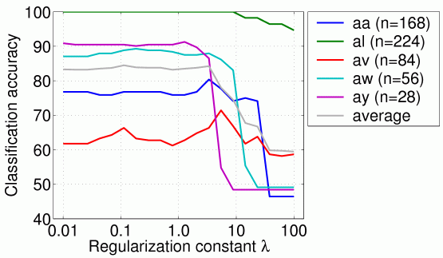
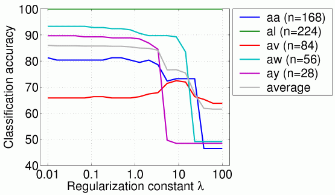

# MATLAB scripts used in "Classifying Matrices with a Spectral Regularization" (ICML 2007)

## What it does

This package solves a classification problem over symmetric matrices with dual spectral norm (trace norm) regularization using a simple interior point method. It was successfully applied to single trial EEG classification problem in the context of brain-computer interfacing (BCI). In this case the input matrix is the short-time covariance estimate or its matrix logarithm ([Tomioka & Aihara, 2007](http://ttic.uchicago.edu/~ryotat/papers/TomAih07.pdf); see also [ [Slides] ](http://ttic.uchicago.edu/~ryotat/talks/TomiokaICMLday3.pdf)).
Given training examples (X1,y1), (X2,y2),..., (Xn,yn), it solves a regularized empirical risk minimization problem:


where W is a real matrix and


The above norm (sum of singularvalues) is called the dual spectral norm, trace norm, Ky-Fan r-norm, or the nuclear norm.

## Results

BCI competition III [dataset IVa](https://www.bbci.de/competition/iii/#data_set_iva).



(a) inputs are covariance matrices (symmetric and positive semidefinite)



(b) inputs are the log of covariance matrices (only symmetric)

You can compare the above results with the results at the competition. Note that the task in the competition was to cope with the small training set size and many participants used the test data to adaptly update their classifiers, which we haven't done here for the sake of simplicity.

## How to use it

1. Download the project.
1. Download the datasets: BCI competition III [dataset IVa](https://www.bbci.de/competition/iii/#data_set_iva). Download also the true labels, save it with the variable name `true_y`.
1. Change the first two lines of `BcicompIIIiva.m` to the path you saved the datasets, as follows:

 ```matlab
 4:       file   = '<your path>data_set_IVa_%s.mat';
 5:       file_t = '<your path>data_set_IVa_%s_truth.mat';
 ```
 (%s is where the name of each subject is substituted.)
1. Run the script `BcicompIIIiva.m`.
1. You can try the logm option by setting `opt.logm` to one as follows:

 ```matlab
 13:      opt.logm = 1;
 ```
 The results are saved in files `result_logm.mat` and `performance_logm_acc.eps`.
1. You can also try another implementation based on CVX toolbox, developed by Michael Grant, Stephen Boyd, and Yinyu Ye (tested with version 1.1 build 520 July 29, 2007). Call `lrds_cvx.m` instead of `lrds_dual.m` as follows:

 ```matlab
 63:      [W, bias] = lrds_cvx(Xtr, Ytr, lambda(ii));
 ```
 Note that the number of electrodes is reduced to 49 (see channels.eps) to make the computation fast. You can skip this but we have seen no significant difference in the performance.

## Request

 * Please cite the following paper if you publish something based on the software provided above:
  * Ryota Tomioka and Kazuyuki Aihara (2007) [Classifying Matrices with a Spectral Regularization](http://ttic.uchicago.edu/~ryotat/papers/TomAih07.pdf),
, Proc. of the 24th Annual International Conference on Machine Learning (ICML2007), pp. 895-902.
 * Please keep the copyright information in the files and provide a link to this page if you make a software based on the codes provided above public.
 * Please contact me when you want to use the software commercially.
 * Please give me feedbacks! good or bad, :-)

## Acknowledgments

I am grateful to Klaus-Robert Müller and my colleagues at Intelligent Data Analysis Group, Fraunhofer FIRST and Technische Universität Berlin for their support in developing this software. I thank Jeremy Hill at Max Planck Institiute for Biological Cybernetics for suggesting me the logm variant.

## Contact

Ryota Tomioka (tomioka [AT] ttic.edu)


